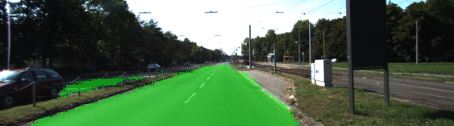

# Semantic Segmentation
***Deep Learning and Convolutional Neural Networks.***

### Overview
In this project, we label the pixels of a road in images using a Fully Convolutional Network (FCN).

[This](https://github.com/udacity/CarND-Semantic-Segmentation) repository contains all instructions for the Project.

##### Prerequisites
Make sure you have the following is installed:
 - [Python 3](https://www.python.org/)
 - [TensorFlow](https://www.tensorflow.org/)
 - [NumPy](http://www.numpy.org/)
 - [SciPy](https://www.scipy.org/)

